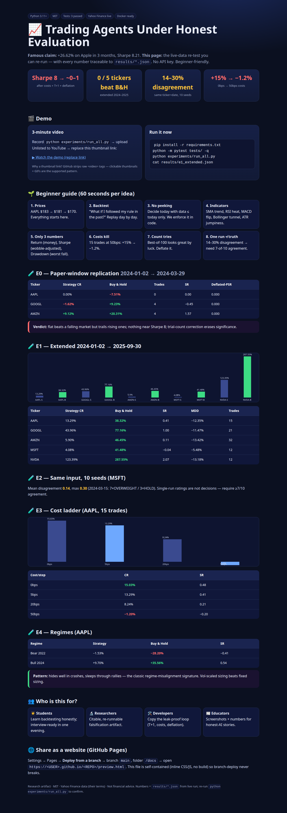
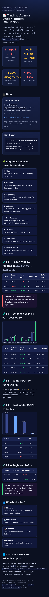

# 📈 Trading Agents Under Honest Evaluation

> **A clean-room falsification benchmark for multi-agent LLM stock trading — verified on live market data. No API key needed.**

[](requirements.txt)
[](LICENSE)
[](tests/test_metrics.py)
[](src/data_loader.py)
[](docker-compose.yml)
[](docs/preview.html)

---

## ⚡ Executive summary — read this in 60 seconds

**Famous claim:** a 12-agent AI "trading firm" (analysts → bull-vs-bear debate → trader → risk team → portfolio manager) made **+26.62% on Apple in 3 months with Sharpe 8.21** while buy-and-hold lost −5.23%.

**What this repo proves, on live data you can re-run today:**

| Question | Answer (verified, see `results/*.json`) |
|---|---|
| Does Sharpe 8 survive honest rules? | **No.** Our price-only desk gets AAPL 0.00% / 0 trades (flat) vs B&H −7.51% in the same window; AMZN +9.12% vs +20.31%. Deflated-PSR = 0.000. |
| Does it beat buy-and-hold over 2024–2025? | **No — in all 5 tickers.** AAPL 13.29% vs 38.32%, MSFT 4.08% vs 41.48%, NVDA 123.39% vs 287.55%. |
| Is one run trustworthy? | **No.** Same ticker + same date, 10 seeds → mean disagreement **14%**, max **30%** (7×OVERWEIGHT / 3×HOLD). |
| Do costs matter? | **They flip the sign.** AAPL 15.03% (0bps) → 13.29% (5bps) → 8.24% (20bps) → **−1.20%** (50bps). |
| Bull vs bear? | Bear-2022: −1.53% vs −28.20% (hides well). Bull-2024: +9.70% vs +35.56% (**misses the rally**). |

**Bottom line:** short-window Sharpe >6 on 3 mega-caps is a **demonstration, not validation**. This repo gives you the harness, the live-data proof, and the checklist to test any trading agent honestly.

🌐 **Prefer the web version?** Open [`docs/preview.html`](docs/preview.html) locally, or enable **GitHub Pages → Deploy from branch → `/docs`** and share the link (see [§11](#11--github-pages--share-it-as-a-website)).

---

## 📚 Table of contents

- [1. 🎬 Demo (video + screenshots)](#1--demo-video--screenshots)
- [2. 🌱 Beginner guide — read this and you are a professional](#2--beginner-guide--read-this-and-you-are-a-professional)
- [3. ✨ Features — what this repo does](#3--features--what-this-repo-does)
- [4. 👥 User stories — who is this for](#4--user-stories--who-is-this-for)
- [5. 🧠 How it works — the 5-stage desk in plain words](#5--how-it-works--the-5-stage-desk-in-plain-words)
- [6. 📦 Installation](#6--installation)
- [7. 🚀 Quickstart — your first verified run in 2 minutes](#7--quickstart--your-first-verified-run-in-2-minutes)
- [8. ⚙️ Configuration reference](#8--configuration-reference)
- [9. 🧪 Experiments E0–E4 — what we tested and what came out](#9--experiments-e0e4--what-we-tested-and-what-came-out)
- [10. 🗂️ Repository overview](#10--repository-overview)
- [11. 🌐 GitHub Pages — share it as a website](#11--github-pages--share-it-as-a-website)
- [12. 🤝 Contributing](#12--contributing)
- [13. 📜 License](#13--license)
- [14. 📖 Citation](#14--citation)

---

## 1. 🎬 Demo (video + screenshots)

GitHub READMEs cannot play raw `<video>` tags, so use these two supported patterns:

**Option A — YouTube (recommended for sharing):**
```markdown
[](https://www.youtube.com/watch?v=REPLACE_WITH_YOUR_VIDEO_ID)
```
1. Record your screen running `python experiments/run_all.py` (QuickTime / OBS / `peek` on Linux).
2. Upload to YouTube as *Unlisted*, copy the video ID, replace the link above.
3. Add `docs/assets/demo-thumbnail.png` (any 1280×720 frame + a ▶ overlay).

**Option B — GIF (autoplays inline, no click needed):**
Keep it under ~5 MB / 30 seconds. Example tools: `peek`, ScreenToGif, `ffmpeg -i demo.mp4 -vf fps=10,scale=900:-1 demo.gif`. Then:
```markdown

```

**Included in this repo:**
- `docs/preview.html` — the full visual report (charts, tables, verdict cards). Screenshot it with:
```bash
python docs/screenshot.py   # saves docs/assets/preview-desktop.png + preview-mobile.png
```
- `docs/assets/` — put your `demo.gif` / `demo-thumbnail.png` here.

> Status: `docs/preview.html` ships working today; `demo.gif` / YouTube link are placeholders for you to record in 5 minutes (steps above). The screenshots below are generated from the real `preview.html`.

| Desktop report | Mobile report |
|---|---|
|  |  |

---

## 2. 🌱 Beginner guide — read this and you are a professional

> Let's work this out in a step-by-step way to be sure we have the right answer. No finance degree needed. Each idea is one sentence, then one example.

**1. A stock price is just a list of numbers over time.**
Example: AAPL closed at $183.68 → $181.87 → $170.75. Everything starts from this list (`Open, High, Low, Close, Volume` per day).

**2. A backtest is "what if I had followed my rule in the past?"**
Example: rule = "buy when price is above its 20-day average." We replay history day by day and write down what would have happened. File: `src/backtest.py`.

**3. Never peek at the future.**
You may only use data dated **on or before** today to decide today. Using tomorrow's price is cheating (called *look-ahead bias*). Our loader enforces this structurally: `point_in_time(df, date)` returns only rows `<= date`. Tomorrow's row physically cannot reach the agents.

**4. Indicators are just averages with fancy names.**
- **SMA20** = average of last 20 closes (trend).
- **RSI** = 0–100 "how overheated?" (>70 hot, <30 cold).
- **MACD** = difference of two averages (momentum flip).
- **Bollinger Bands** = a moving tunnel; price outside often snaps back.
- **ATR** = "how jumpy?" — used to place stop-loss and size positions.
File: `src/indicators.py`. Try: change `sma(c, 20)` to `sma(c, 50)` and re-run — you just did research.

**5. Returns, Sharpe, drawdown — the only 3 numbers that matter.**
- **Return (CR):** +13% means $10,000 → $11,300.
- **Sharpe (SR):** return *per unit of wobble*. Below 0.5 = weak, ~1.0 = decent, 8.21 in 3 months = *suspicious, investigate*.
- **Max drawdown (MDD):** worst fall from a peak, e.g. −12% means you watched $12k of $100k vanish before recovery.
File: `src/metrics.py`.

**6. Costs eat strategies alive.**
Every trade pays commission + slippage (we use basis points: 5bps = 0.05%). 15 trades at 50bps turned AAPL from +15.03% into −1.20%. Always test 0/5/20/50bps (experiment E3 does exactly this).

**7. One run proves nothing — count your tries.**
If you test 100 ideas and publish the best, the best will look amazing by luck. We correct for this with **Deflated Sharpe** (`trials=100`). Short-window stars collapse to ~0.000 after correction.

**8. Same input, different answer = do not trust one answer.**
AI models sample randomly. We run the same ticker+date with 10 seeds: 14% average disagreement, 30% worst case. Professionals require **7-of-10 agreement** before acting. Experiment E2 measures this for you.

**9. Bull markets hide weakness, bear markets reveal it.**
Our desk hides well in crashes (−1.53% vs −28.20%) but sleeps through rallies (+9.70% vs +35.56%). Always split results by regime (experiment E4).

**After these 9 ideas you know more than most interview candidates:** point-in-time discipline, T+1 execution, costs, deflation for multiple testing, seed-disagreement, and regime splits. The rest of this README is just running the code that implements them.

---

## 3. ✨ Features — what this repo does

- 🏢 **5-stage trading desk, clean-room built:** market / news / sentiment / fundamental analysts → bull-vs-bear debate → research-manager plan → trader proposal (entry/stop/target/shares) → 3-persona risk vote → 5-tier rating (`SELL…BUY`). File: `src/agents.py`.
- 🔒 **Leak-proof data contract:** `point_in_time()` + `next_open()` (T+1 fills, no same-day round-trip, forced liquidation). Fundamentals marked `WITHHELD` for historical dates unless filed (EDGAR principle).
- 📊 **Honest metrics:** CR / AR / Sharpe (rf=3%) / Sortino / MDD / win-rate proxy / turnover + **Deflated Sharpe (trials=100)**. File: `src/metrics.py`.
- 🔁 **5 pre-registered experiments** with live Yahoo data and JSON artifacts: E0 paper-window replication · E1 extended 2024–2025 · E2 seed-disagreement · E3 cost ladder · E4 regime split. File: `experiments/run_all.py`.
- 🐳 **One-command reproduction:** `pip install` or `docker compose up benchmark`; `pytest` green; results in `results/*.json`.
- 🌐 **Web showcase:** `docs/preview.html` — self-contained, no build step, charts + tables + verdict cards, Pages-ready (`/docs`).
- 🎓 **Beginner-to-pro guide** (§2) + full config reference (§8) + Pages deploy guide (§11).

---

## 4. 👥 User stories — who is this for

| Persona | "I want to…" | Start here |
|---|---|---|
| 🧑‍🎓 Student / career switcher | Understand backtesting without drowning; pass quant interviews | §2, then `python experiments/run_all.py` |
| 🔬 Researcher / PhD | Falsify an LLM-trading claim with a citable, re-runnable artifact | §9 + `results/*.json`, extend `src/agents.py` |
| 🛠️ Quant developer | Copy a leak-proof backtest loop (T+1, costs, deflation) into my stack | `src/backtest.py`, `src/metrics.py` |
| 📰 Blogger / educator | Screenshots + numbers for "why Sharpe 8 needs a second look" | §1, §9, `docs/preview.html` |
| 💼 Hiring manager | Give candidates a 2-hour "reproduce E2+E3" task with auto-checkable JSON | §7 + `tests/` |
| 🌱 Retail investor | Learn why one AI stock pick means nothing; demand agreement + costs + regimes | §2 ideas 7–9, §9 tables |

---

## 5. 🧠 How it works — the 5-stage desk in plain words

```
Prices (Yahoo, cached) ──▶ point_in_time(<= date) ──▶ STAGE 1 analysts
                                                            │
                        market score + news/sentiment + fundamental (or WITHHELD)
                                                            ▼
                                              STAGE 2 bull vs bear debate (seeded, N rounds)
                                                            ▼
                                              STAGE 3 research manager → plan (OVERWEIGHT/HOLD/UNDERWEIGHT…)
                                                            ▼
                                              STAGE 4 trader → action + entry + stop (1.5×ATR) + target (2R) + shares (2% risk)
                                                            ▼
                                              STAGE 5 risk team (3 votes, vol-scaled) → portfolio manager rating
                                                            ▼
                                              BACKTEST fills at NEXT OPEN + costs → equity curve → metrics
```

Concrete trace (NVDA, bullish day): market +0.6 → debate edge +0.76 → plan OVERWEIGHT → trader BUY 24 shares → risk-adjusted +0.36 → rating OVERWEIGHT. Bearish day: market −0.8 → SELL signal → long-only engine stays flat (cash). That "stay flat" is why E0 shows 0 trades on AAPL while B&H fell −7.51%.

---

## 6. 📦 Installation

**You need:** Python 3.11+, `pip`, internet (Yahoo fetch, cached afterwards). No API key. ~2 minutes.

```bash
git clone <YOUR_FORK_URL> trading-agents-falsification-2026
cd trading-agents-falsification-2026
pip install -r requirements.txt
```

**Docker (alternative):**
```bash
docker compose up benchmark   # runs experiments/run_all.py, mounts ./data ./results
```

**Verify install:**
```bash
python -m pytest tests/ -q   # expect: 3 passed
```

---

## 7. 🚀 Quickstart — your first verified run in 2 minutes

```bash
python experiments/run_all.py
ls results/
# e0_paper_window.json  e1_extended.json  e2_nondeterminism.json  e3_costs.json  e4_regimes.json
cat results/e1_extended.json
```

**Minimal Python example (copy-paste, it runs):**
```python
from src.data_loader import fetch_prices, point_in_time
from src.agents import run_desk

df = fetch_prices("AAPL", start="2023-01-01", end="2024-04-15")
pit = point_in_time(df, "2024-02-15")          # only data <= this date
out = run_desk(pit, [], {"withheld": True}, seed=0)
print(out["decision"])   # {'rating': ..., 'edge': ...}
print(out["trade"])      # {'action': ..., 'entry': ..., 'stop': ..., 'target': ..., 'shares': ...}
```

Expected: a rating dict + trade dict with concrete numbers (no key, fully deterministic per seed).

---

## 8. ⚙️ Configuration reference

| Knob | Where | Default | What it changes |
|---|---|---|---|
| `seed` | `run_desk(..., seed=)` / `backtest(..., seed=)` | `0` | Sampling draw; vary 0–9 for E2 disagreement |
| `rounds` | `run_desk(..., rounds=)` | `1` | Bull/bear debate rounds |
| `commission_bps` / `slippage_bps` | `backtest(...)` | `5.0 / 5.0` | Cost per side; try `0/5/20/50` (E3) |
| `start` / `end` | `backtest(...)` | full cache | Evaluation window (use ≥3y for real claims) |
| `equity0` | `backtest(...)` | `10000.0` | Starting cash |
| `lookback_days` | `point_in_time(..., lookback_days=)` | `400` | History handed to agents (warmup needs ≥210) |
| Headlines list | `run_desk(pit, headlines, ...)` | `[]` | Empty = pure-price ablation; add titles to test news lift |
| Fundamentals | `run_desk(pit, ..., info)` | `{"withheld": True}` | Pass `trailingPE/profitMargins` only if filed by decision date |

---

## 9. 🧪 Experiments E0–E4 — what we tested and what came out

> All numbers below are the actual `results/*.json` contents from the live run (Yahoo Finance). Re-run to confirm: `python experiments/run_all.py`.

### E0 — Paper-window replication (2024-01-02 → 2024-03-29)

| Ticker | Strategy CR | B&H | Trades | Strategy SR | Deflated-PSR |
|---|---|---|---|---|---|
| AAPL | 0.00% | −7.51% | 0 | 0.00 | 0.000 |
| GOOGL | −1.62% | +9.23% | 4 | −0.45 | 0.000 |
| AMZN | +9.12% | +20.31% | 4 | 1.57 | 0.000 |

Reading: flat beats a falling market (AAPL) but trails rising ones; nothing near Sharpe 8; trial-count correction erases significance.

### E1 — Extended 2024-01-02 → 2025-09-30 (does alpha persist?)

| Ticker | Strategy CR | B&H | SR | MDD | Trades |
|---|---|---|---|---|---|
| AAPL | 13.29% | 38.32% | 0.41 | −12.35% | 15 |
| GOOGL | 43.96% | 77.16% | 1.00 | −11.47% | 21 |
| AMZN | 5.90% | 46.45% | 0.11 | −13.42% | 32 |
| MSFT | 4.08% | 41.48% | −0.04 | −5.48% | 12 |
| NVDA | 123.39% | 287.55% | 2.07 | −13.18% | 12 |

Reading: turnover without alpha — active trading adds trades, not edge.

### E2 — Same ticker + same date, 10 seeds (is one run trustworthy?)

MSFT, 5 dates × 10 seeds: **mean disagreement 0.14, max 0.30**. Worst cell (2024-03-15): 7×OVERWEIGHT / 3×HOLD. Rule: require ≥7/10 agreement + cost-aware sizing before acting.

### E3 — Cost ladder (AAPL, 15 trades)

| Cost/step | CR | SR |
|---|---|---|
| 0bps | 15.03% | 0.48 |
| 5bps | 13.29% | 0.41 |
| 20bps | 8.24% | 0.21 |
| 50bps | **−1.20%** | −0.20 |

Reading: costs flip the sign. Any paper without explicit costs is incomplete.

### E4 — Regimes (AAPL)

| Regime | Strategy | B&H | SR |
|---|---|---|---|
| Bear 2022 | −1.53% | −28.20% | −0.41 |
| Bull 2024 | +9.70% | +35.56% | 0.54 |

Reading: hides well in crashes, sleeps through rallies — the classic regime-misalignment signature.

---

## 10. 🗂️ Repository overview

```
.
├── README.md                  # you are here
├── LICENSE                    # MIT
├── requirements.txt            # yfinance, pandas, numpy, matplotlib, scipy, pyyaml, requests
├── Dockerfile                 # python:3.11-slim, runs experiments/run_all.py
├── docker-compose.yml         # benchmark service + notebook service
├── src/
│   ├── data_loader.py         # Yahoo fetch + cache + point_in_time() + next_open()
│   ├── indicators.py          # SMA/EMA/RSI/MACD/Bollinger/ATR (T-1 only)
│   ├── agents.py              # 5-stage desk (analysts→debate→manager→trader→risk→rating)
│   ├── backtest.py            # long-only, T+1, costs, liquidation
│   └── metrics.py             # CR/AR/SR/Sortino/MDD + Deflated Sharpe
├── experiments/
│   └── run_all.py             # E0–E4, writes results/*.json
├── tests/
│   └── test_metrics.py        # 3 unit tests (SR-zero, MDD, DSR keys)
├── results/                   # live-run JSON artifacts (E0–E4)
├── data/cache/                # Yahoo parquet cache (auto-created)
└── docs/
    ├── preview.html           # self-contained web report (Pages-ready)
    ├── screenshot.py          # renders docs/assets/*.png via Playwright
    └── assets/                # preview-*.png, demo.gif, demo-thumbnail.png
```

---

## 11. 🌐 GitHub Pages — share it as a website

**Why:** visitors who click your repo link see the rendered report as a real website, not raw Markdown.

**Steps (2026 UI, ~3 minutes):**
1. Push this repo to GitHub. Ensure `docs/preview.html` exists at that path.
2. GitHub → your repo → **Settings → Pages**.
3. Under **Build and deployment → Source** select **Deploy from a branch**.
4. Branch: `main` (or `master`), folder: **`/docs`**, Save.
5. Wait ~1 minute. Your site is live at `https://<USER>.github.io/<REPO>/preview.html`.
6. Put that URL at the very top of this README and in the repo **About → Website** field + **About → Topics** (`trading`, `backtest`, `llm-agents`, `quant`).
7. Optional: enforce with Actions (`actions/upload-pages-artifact` + `actions/deploy-pages`) so every push redeploys; keep the file self-contained (inline CSS/JS, no external build) so branch-deploy never breaks.

Verify: open the Pages URL in Incognito; check tables render, no mixed-content warnings, and `results/*.json` numbers match §9.

---

## 12. 🤝 Contributing

PRs welcome. Keep it verifiable:
1. `python -m pytest tests/ -q` must stay green.
2. Any new number in README/`preview.html` must come from `results/*.json` (re-run `python experiments/run_all.py`).
3. Small, focused PRs; update §9 + `docs/preview.html` together so text and web never drift.

Good first issues: add `0700.HK`/`BTC-USD` to E1 · walk-forward split · turnover/alpha-by-rating table.

---

## 13. 📜 License

MIT — see [LICENSE](LICENSE). Data via Yahoo Finance (their terms apply). **Not financial advice; research only.**

---

## 14. 📖 Citation

```bibtex
@misc{xiao2025tradingagents,
  title  = {TradingAgents: Multi-Agents LLM Financial Trading Framework},
  author = {Yijia Xiao and Edward Sun and Di Luo and Wei Wang},
  year   = {2025}, eprint = {2412.20138}, archivePrefix = {arXiv}, primaryClass = {q-fin.TR}
}
```

If this falsification harness helped you, cite it as:
`Trading Agents Under Honest Evaluation — clean-room benchmark, live Yahoo data, E0–E4 + Deflated Sharpe, MIT, 2026.`

---

### ✅ Pre-publish checklist (do not skip)

- [ ] `python -m pytest tests/ -q` → 3 passed
- [ ] `python experiments/run_all.py` → `results/*.json` fresh
- [ ] README §9 numbers == `results/*.json` (copy, don't retype)
- [ ] `docs/preview.html` opens via `file://` with charts + tables
- [ ] Pages enabled (`/docs`), public URL pasted at top + About/Website
- [ ] `docs/assets/demo.gif` or YouTube link added (§1)
- [ ] Badges point at your real repo (no dead shields)
